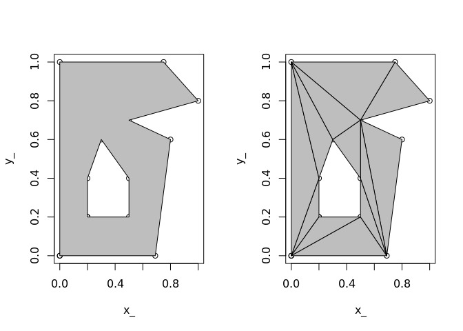

<!-- README.md is generated from README.Rmd. Please edit that file -->
[](https://cran.r-project.org/package=rearcut) [](https://travis-ci.org/hypertidy/rearcut) [](https://travis-ci.org/hypertidy/rearcut) [](https://ci.appveyor.com/project/hypertidy/rearcut) [](https://codecov.io/github/hypertidy/rearcut?branch=master)

rearcut
=======

The goal of rearcut is to triangulate polygons using the [Ear clipping algorithm](https://en.wikipedia.org/wiki/Polygon_triangulation#Ear_clipping_method). This is also referred to as [ear cutting](http://cgm.cs.mcgill.ca/~godfried/teaching/cg-projects/97/Ian/cutting_ears.html) and this package directly uses the Mapbox Javascript library [earcut](https://github.com/mapbox/earcut).

The original motivation for rearcut is to triangulate polygons for [silicate](https://github.com/hypertidy/silicate.git).

A polygon and one of its possible triangulations by ear clipping.

``` r
library(rearcut)
minpoly_xy <- na.omit(minpoly)
nas <- which(is.na(minpoly$x_))
## this is the "indicate where holes start" convention
hole_index <- nas - (seq_along(nas) - 1)
op <- par(mfrow = c(1, 2))
plot(minpoly)
polypath(minpoly, col = "grey", rule = "evenodd")

## a little inconvenient, but we flip between NA-separated rings
## and a denser encoding
idx <- earcut(minpoly_xy, holes = hole_index)
plot(minpoly_xy)
jk <- apply(matrix(idx, nrow = 3), 2, function(ix) polygon(minpoly_xy[ix, ], col = "grey"))
```



``` r
par(op)
```

The basic function `earcut` for generic data is to be called with x/y coordinates in `x` (using the `grDevices::xy.coords` conventions) and an optional marker index of where holes are.

``` r
## example data from polypath
## rather than separate rings by NA we indicate those positions
## (here the hole starts at 5 and is the only one)
x <- c(.1, .1, .9, .9, .2, .2, .8, .8)
y <- c(.1, .9, .9, .1, .2, .8, .8, .2)
library(rearcut)
ind <- earcut(cbind(x, y), holes = 5L)
rearcut:::plot_tri(x, y, ind, col = "grey")
```


The idea is that more specialist contexts will wrap this lower level.

More examples.

A polygon data set from the Mapbox test suite.

``` r
txt <- readLines("https://raw.githubusercontent.com/mapbox/earcut/master/test/fixtures/water-huge.json")
library(dplyr)
#> 
#> Attaching package: 'dplyr'
#> The following objects are masked from 'package:stats':
#> 
#>     filter, lag
#> The following objects are masked from 'package:base':
#> 
#>     intersect, setdiff, setequal, union
x <- jsonlite::fromJSON(txt) %>% purrr::map_df(tibble::as_tibble, .id = "poly")


x <- x %>% filter(poly == 1)
tri <- earcut(x[c("V1", "V2")])
rearcut:::plot_tri(x$V1, x$V2, tri)
```


A geographic data set, the outline and internal waters of Tasmania's main island.

``` r
taslakes_xy <- na.omit(taslakes)
nas <- which(is.na(taslakes$x_))
## this is the "indicate where holes start" convention
hole_index <- nas - (seq_along(nas) - 1)

idx <- earcut(taslakes_xy, holes = hole_index)
plot(taslakes_xy, type = "n")
jk <- apply(matrix(idx, nrow = 3), 2, function(ix) polygon(taslakes_xy[ix, ], col = "grey", border = "#00000044"))
```


Installation
------------

Rearcut may be installed from Github.

``` r
## install.packages("devtools")
devtools::install_github("hypertidy/rearcut")
```

Please note that this project is released with a [Contributor Code of Conduct](CODE_OF_CONDUCT.md). By participating in this project you agree to abide by its terms.
